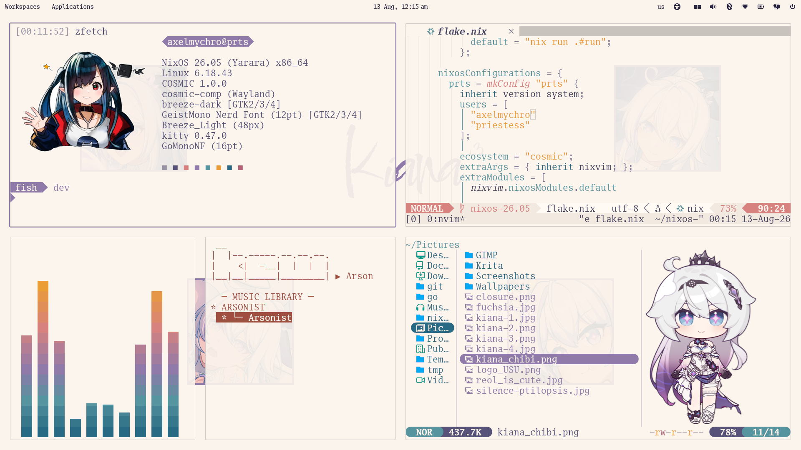
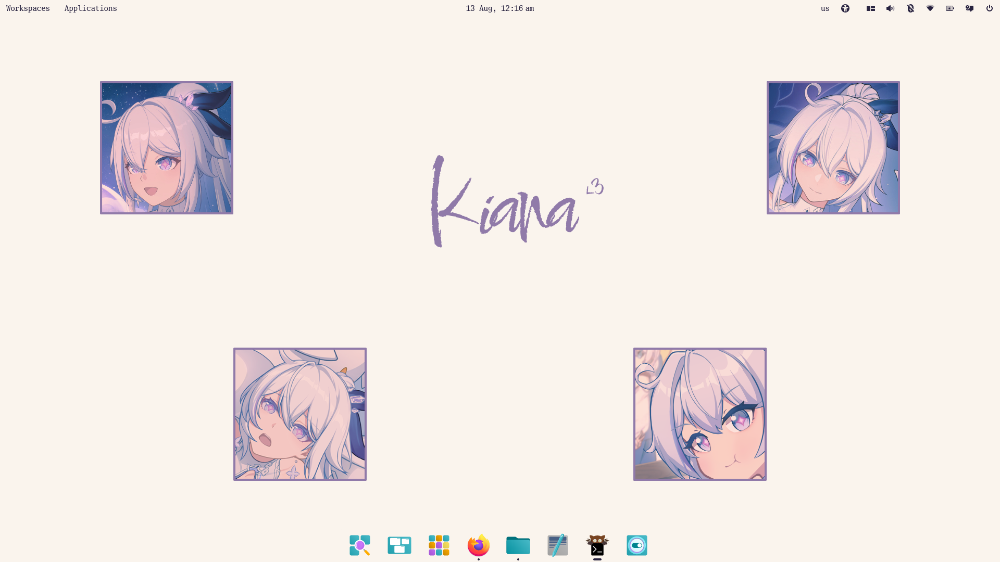

# NixOS Config

- Release: 26.05 x86_64-linux
- Bootloader: [GRUB](https://www.gnu.org/software/grub) ([theme](https://github.com/Shelton786/Grub-Themes-Arknights_Priestess))

## Example Configuration

  
Preview

  
  

- Host: PRTS
- Nvme ext4 storage
- Intel integrated GPU
- Nvidia discrete GPU
- Ecosystem: [Cosmic DE](https://system76.com/cosmic)
- Font: [Go Mono](https://github.com/golang/image/tree/master/font/gofont/ttfs) [Nerd Font](https://www.nerdfonts.com)
